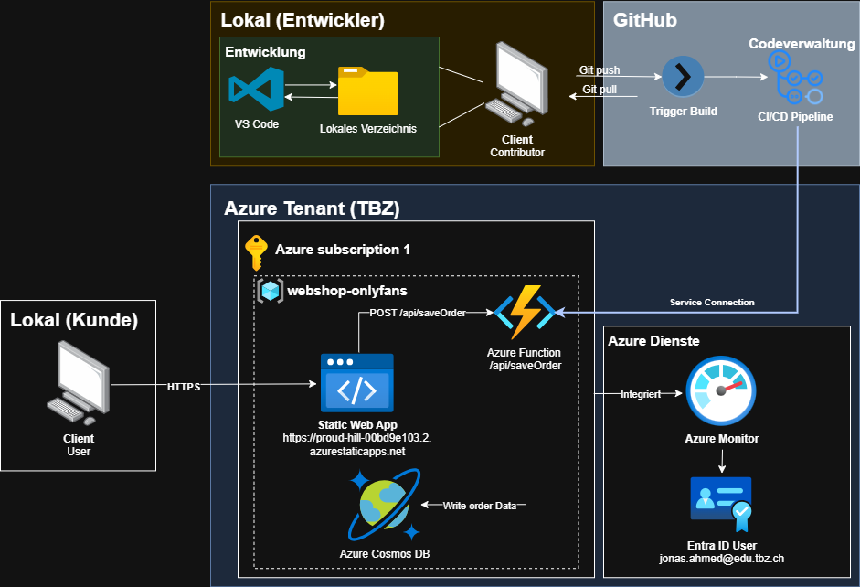
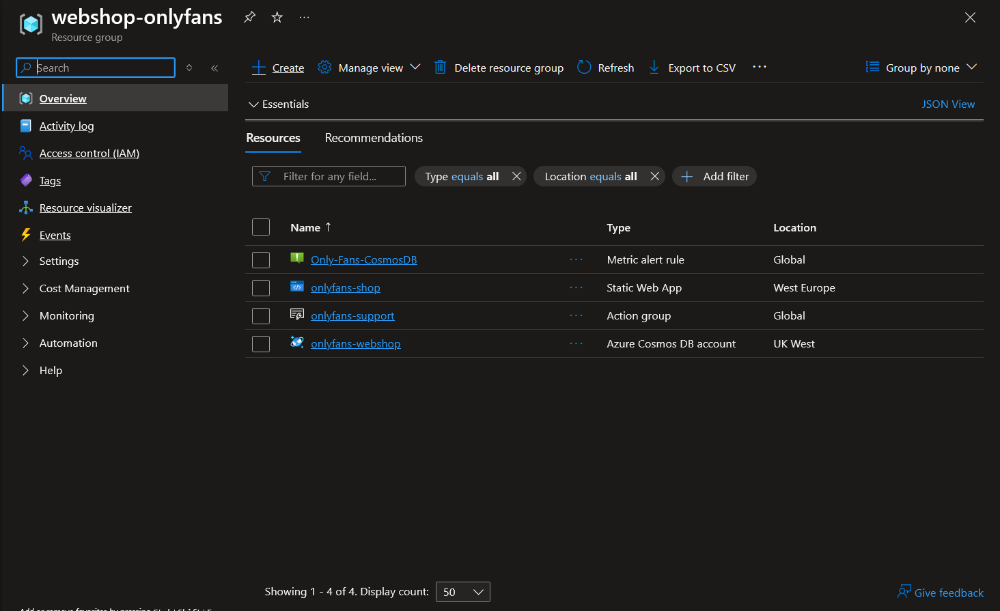
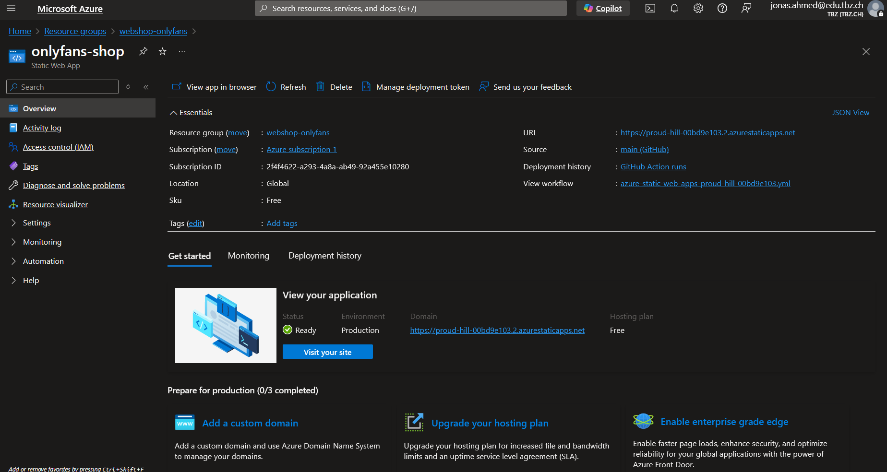
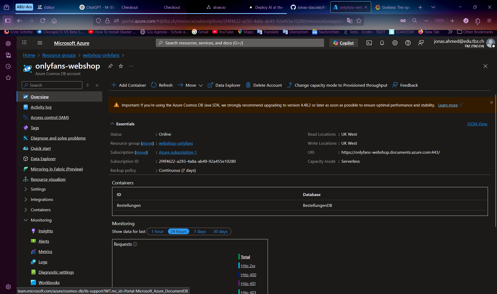
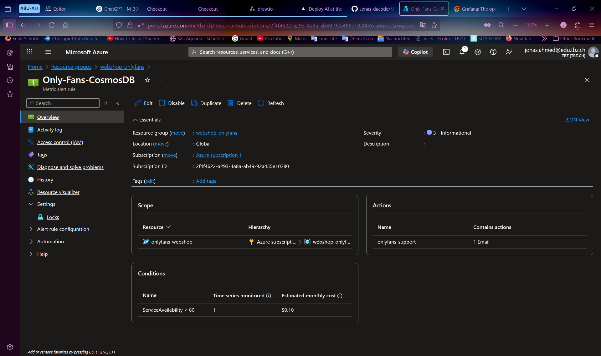

# Ventilatoren-Webshop auf Azure

## Projektübersicht

Dieses Projekt stellt einen vollständig in Microsoft Azure gehosteten Webshop für Ventilatoren dar. Ziel ist die Bereitstellung einer statischen Website mit dynamischen Funktionen wie Warenkorb und Bestellformular sowie automatisiertem Deployment, Backup und Monitoring.

➡️ **Live-Demo:** [Zur Webanwendung](https://proud-hill-00bd9e103.2.azurestaticapps.net/)

---

## Projektziele

- Hosting einer statischen Webanwendung in Azure
- Serverlose API-Integration mit Azure Functions
- Speicherung von Bestelldaten in Azure Cosmos DB
- CI/CD über GitHub Actions bei jedem Push
- Monitoring & Logging über Azure Monitor
- Erstellung eines logischen Architekturplans
- Benutzerfreundliches, responsives Frontend mit Einkaufslogik

---

## Technologie-Stack

| Bereich           | Dienst / Tool                      |
|-------------------|------------------------------------|
| Hosting           | Azure Static Web Apps              |
| CI/CD             | GitHub Actions                     |
| Datenbank         | Azure Cosmos DB (API for NoSQL)    |
| Monitoring        | Azure Monitor + Application Insights |
| Backup (optional) | Azure Blob Storage                 |
| Frontend          | HTML, CSS, JavaScript              |
| API               | Azure Functions (Node.js)          |
| Quellcodehosting  | GitHub                             |




---

## Projektstruktur

| Ordner / Datei     | Inhalt                                                  |
|--------------------|---------------------------------------------------------|
| `/index.html`      | Startseite mit Produktübersicht und Warenkorb           |
| `/checkout.html`   | Formularseite zur Bestellabgabe                         |
| `/api/saveOrder/`  | Azure Function zur Speicherung von Bestellungen         |
| `package.json`     | Abhängigkeiten für Azure Function                       |
| `.github/workflows/` | GitHub Actions Workflow für CI/CD                    |
| `/docs/` (optional) | Netzpläne, Architekturdiagramme                         |
| `README.md`        | Projektbeschreibung und Anleitung                        |

---


---

## Hauptkomponenten des Netzwerks


- **Azure Static Web App**  
  Hostet das statische Frontend und die Azure Function API (`/api/saveOrder`).

- **Azure Cosmos DB (BestellungenDB)**  
  Persistiert die Bestelldaten als JSON-Dokumente im Container `Bestellungen`.

- **Azure Function (Node.js)**  
  Verarbeitet `POST`-Requests vom Bestellformular und speichert in Cosmos DB.

- **GitHub Actions**  
  CI/CD Workflow zur automatischen Bereitstellung bei Änderungen im `main`-Branch.

- **Azure Monitor**  
  Überwacht Fehler, Verfügbarkeit und Performance der App (Log-Erweiterung möglich).



Resource Gruppe



Statische Web App


CosmosDB



---

**Portabilität:**

Das Projekt ist dank seines modularen Aufbaus und der Nutzung standardisierter Webtechnologien hochgradig portabel. Die statische Web-App lässt sich auf verschiedenen Plattformen hosten, Microservices können in andere Function-as-a-Service-Umgebungen migriert werden, und die Datenhaltung kann auf andere NoSQL-Datenbanken übertragen werden. Die Abkopplung von Plattform-spezifischen Features, mit Ausnahme der optionalen Azure-Dienste (z. B. Entra ID), macht das gesamte System flexibel und zukunftssicher.


---

## Web-App-Funktionen

- Produktübersicht mit Bild, Preis, Beschreibung
- Interaktiver Warenkorb (Add/Remove, Mengenauswahl)
- Bestellformular mit Validierung
- Responsive Design für Mobilgeräte & Desktop
- Speichern von Bestellungen in Cosmos DB
- Dark-Mode-Unterstützung per Button
- Feedback nach Bestellabschluss

---

## CI/CD & Deployment

- Trigger: **Push auf `main`**
- GitHub Actions mit `azure/static-web-apps-deploy@v1`
- `.yml`-Datei im Workflow-Verzeichnis

```yaml
app_location: "/"
api_location: "api"
output_location: "/"
```

- Secrets: 
    - `AZURE_STATIC_WEB_APPS_API_TOKEN` im GitHub-Repo hinterlegt

    - `Conneciton String` der CosmosDB in der API hinterlegt

---

## Sicherheitsaspekte

- **HTTPS-Verbindung** standardmässig aktiviert (über Azure SWA)
- **Connection Strings** als Umgebungsvariablen gespeichert (COSMOS_DB_CONNECTION_STRING)
- Keine Speicherung von sensitiven Nutzerdaten im Browser
- Zugriff auf Backend nur über definierte API-Route (/api/saveOrder)
- Nur CI/CD-Deployments möglich (kein direkter Zugang)

---

## Voraussetzungen

- Microsoft Azure Abonnement (z. B. Azure for Students)
- GitHub-Konto
- Azure Static Web App Ressource
- Cosmos DB

--- 

## Bewertungsmatrix

**Trennung in Microservices:** 
Die Applikation ist in ein getrenntes Frontend (Webshop) und einen API-Service (/api/saveOrder) aufgeteilt. Die API ist als eigenständiger Node.js-Service mit eigener package.json strukturiert. Damit ist eine funktionale und technische Trennung gegeben

---

## Ausblick/Erweiterungsmöglichkeiten

- Admin-Oberfläche zur Bestellungseinsicht
- Eigene Domäne nutzen
- Validierte API-Responses mit Fehlerfeedback

---

## Autor

Shala Rony,
Zivanovic Viktor,
Ahmed Jonas

M300-Projektarbeit 2025
Technische Berufsschule Zürich
